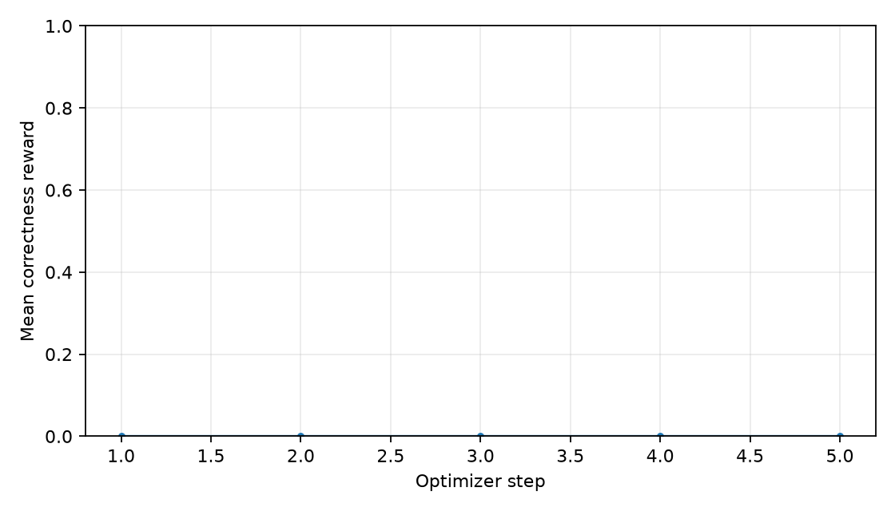
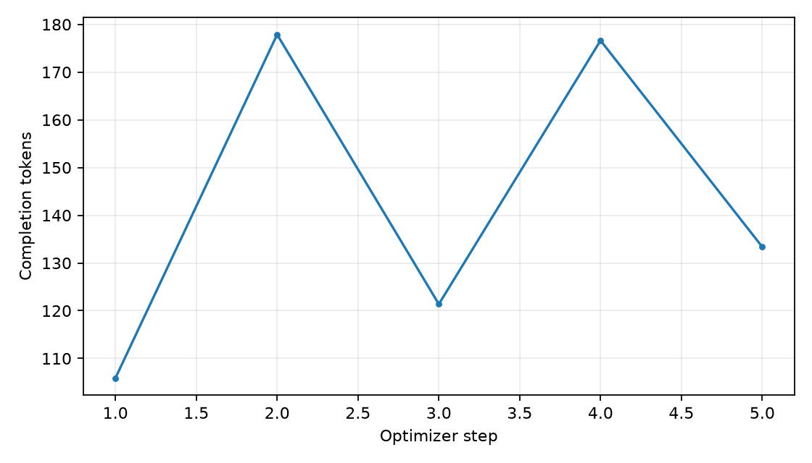
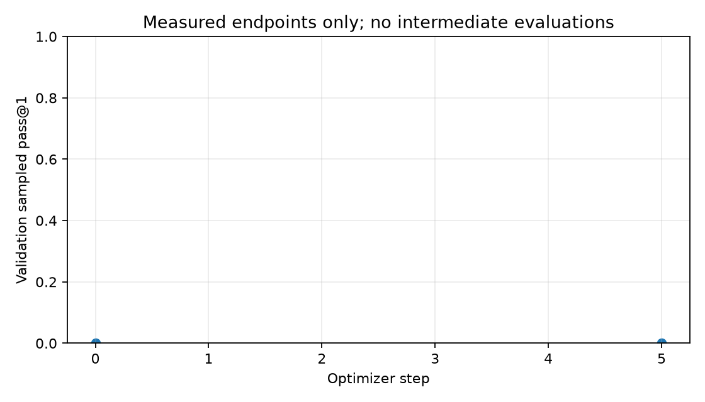
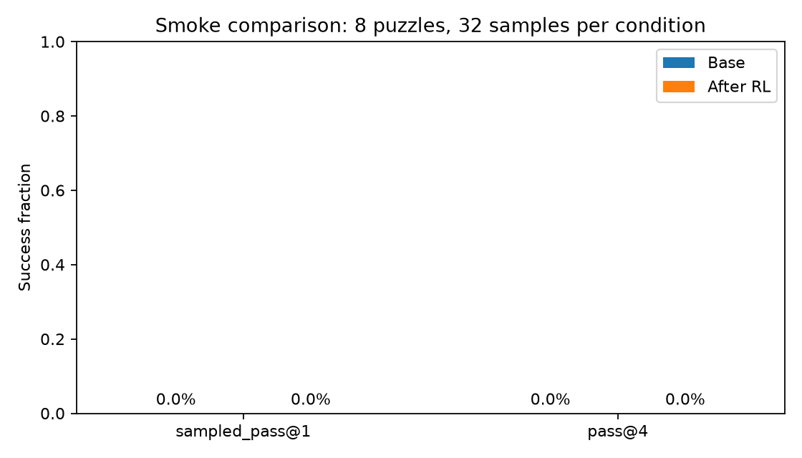

# TinyReasonRL

Can direct reinforcement learning improve a small pretrained model's Countdown
accuracy without an intervening supervised fine-tuning (SFT) stage?

This is a local, single-GPU experiment using **Qwen3.5-0.8B-Base**, LoRA, and
verifiable arithmetic rewards. Increased reward is evidence of improved task
performance; it does not establish that genuine reasoning emerged. Pretraining
already supplies capabilities, and this experiment does not start from random weights.

**Latest finding:** the initial 256-token pilot had no correctness signal. A
1,024-token probe exposed two correct final answers that the original tag-count
rule rejected. The verifier now judges the last answer block (`final-answer-v2`),
and the same saved long outputs score 2/32 correct (2/8 puzzles solved). These
are base-model capabilities before RL, not an RL improvement. Original results
are preserved alongside separately rescored artifacts.

## Setup (Windows PowerShell)

Python 3.11 and an NVIDIA GPU supporting BF16 are required for the experiment.
The initial host is an RTX 5070 Ti with 16 GB VRAM. No SFT data or training is used.

```powershell
uv venv --python 3.11 .venv
uv pip install --python .venv\Scripts\python.exe torch --index-url https://download.pytorch.org/whl/cu128
uv pip install --python .venv\Scripts\python.exe -r requirements-lock.txt
uv pip install --python .venv\Scripts\python.exe -e . --no-deps
.venv\Scripts\python.exe -m pytest -q
```

The CUDA wheel is important for this GPU. System Python is not modified.
Resolved package versions will be recorded with experiment results.

To reproduce the installed environment, use `requirements-lock.txt` after
installing the CUDA torch wheel, then install this project with `-e . --no-deps`.

## Run the first milestone

```powershell
.venv\Scripts\python.exe -m tinyreasonrl.data
.venv\Scripts\python.exe -m tinyreasonrl.evaluate --limit 1 --samples 4 --output results/milestone1
```

Data preparation found 490,364 source rows, 449,570 unique puzzles, and 40,794
duplicates. Splits contain 404,836 training, 22,389 validation, and 22,345 test
puzzles. `results/dataset-manifest.json` records counts and example rows.

The first actual run completed on the RTX 5070 Ti in 20.6 seconds of generation
and scoring, excluding loading. Peak PyTorch allocated memory was 1.47 GiB
(reserved: 1.53 GiB; these exclude other desktop applications).
Four samples on one validation puzzle produced zero correct answers: one
returned only the target and three were truncated at 256 tokens. These are
pipeline smoke results, **not a meaningful accuracy estimate**. Full generations,
metrics, and runtime metadata are in `results/milestone1/`.

Current tested versions: Python 3.11, PyTorch 2.11.0+cu128, Transformers 5.16.1,
TRL 1.12.0, PEFT 0.20.0, Datasets 5.0.1, Accelerate 1.14.0. The text-only
`Qwen3_5ForCausalLM` loader reports no missing or mismatched weights.

## Direct GRPO training

```powershell
# Small run, then prove optimizer/RNG/checkpoint restart works.
.venv\Scripts\python.exe -m tinyreasonrl.train --max-steps 1 --output checkpoints/my-smoke --results results/my-smoke
.venv\Scripts\python.exe -m tinyreasonrl.train --max-steps 5 --output checkpoints/my-smoke --results results/my-smoke --resume checkpoints/my-smoke/checkpoint-1

# The configured 200-step experiment (not yet validated as useful learning).
.venv\Scripts\python.exe -m tinyreasonrl.train

# Evaluate an adapter with the same plain prompt and sampling settings.
.venv\Scripts\python.exe -m tinyreasonrl.evaluate --limit 8 --samples 4 --adapter checkpoints/smoke/final --output results/after-smoke-validation

# Optional separate prompt-format diagnostic; it is not the main experiment.
.venv\Scripts\python.exe -m tinyreasonrl.evaluate --config configs/chat-diagnostic.json --limit 8 --samples 4 --output results/chat-diagnostic

.venv\Scripts\tensorboard.exe --logdir results/smoke-training/tensorboard
```

Training uses BF16, rank-8 LoRA on all text-model linear layers except the output
head, alpha 16, no adapter dropout, gradient checkpointing, and a constant 1e-5
learning rate. There are 5,411,328 trainable parameters (0.7141% of the adapted
model). AdamW updates these adapters; pretrained model weights remain frozen.

The microbatch is one completion, with eight gradient-accumulation steps and
four generations per prompt. In the installed TRL version this resolves to
eight generated completions (two unique prompts) per optimizer update. A group
of four is not four independent optimization steps.

The loss is explicitly `dapo`, TRL's default token normalization, using
group-standardized rewards. This is GRPO-style optimization with DAPO loss
normalization, not an exact reproduction of the original paper's loss.
`beta=0.0` disables the reference-policy KL penalty, so there is no KL curve.
There is no formatting bonus, reward model, SFT, quantization, or vLLM server.
The initial training subset is the first 4,096 unique training puzzles, sampled
in a seeded shuffled order by TRL.

Evaluation uses top-k 50 (the installed Transformers generation fallback), while
training uses top-k 0 (TRL's unrestricted top-k sampling). Both use temperature
0.8 and top-p 0.95. These existing sampling choices are now explicit in code;
before/after evaluation uses the same settings. Training reward should not be
interpreted as an estimate of evaluation accuracy under a different sampler.

Each optimizer step logs reward, fraction of zero-variance groups, completion
length, gradient norm, and peak allocated GPU memory to JSON. TRL metrics also
go to TensorBoard. Every sampled training completion is saved with its step and
verifier result. Checkpoints include adapters, optimizer, scheduler, RNG, and
trainer state; final adapters are separate. Retention keeps the four latest
checkpoints, so older checkpoint paths may disappear during resumed training.
The seed improves reproducibility but does not guarantee bitwise-identical GPU
runs across software/hardware changes.

The actual smoke run reached step one, then resumed to step five. All 40
training completions earned zero reward; every logged gradient norm was zero.
Checkpoint inspection confirmed that LoRA B matrices stayed zero and adapters
at steps two and five were identical. Peak allocated memory was 2.49 GiB, with
3.05 GiB reserved. **This validates execution and restart, not successful RL
learning.** Some local checks ran concurrently, so timings are not throughput
benchmarks. Evidence is in `results/smoke-training/`; local checkpoints are in
`checkpoints/smoke/` and deliberately excluded from Git.

The original plain prompt and a separate official-chat-template diagnostic are
both available. The latter sets `enable_thinking=false`, which inserts an empty
thinking block, and ends at the chat end token. It still permits scratch work in
the answer body, but it changes the prompting condition and cannot be treated
as evidence for the original reasoning-emergence question. Neither condition
provides worked solutions or modifies the base weights before RL.

## Original strict-format pilot results (2026-09-07)

This table preserves the initial `strict-single-answer-v1` scoring and training
history. The current verifier differs; see the correction below.

| Condition | Puzzles | Answers | Sampled pass@1 | pass@4 | Valid expression | Truncated |
|---|---:|---:|---:|---:|---:|---:|
| Base, plain prompt | 100 | 400 | 0% | 0% | 2.75% | 50.5% |
| Base, matched smoke subset | 8 | 32 | 0% | 0% | 0% | 50.0% |
| After 5 GRPO steps, same subset | 8 | 32 | 0% | 0% | 0% | 50.0% |
| Base, separate chat diagnostic | 8 | 32 | 0% | 0% | 0% | 90.625% |

The 100-puzzle validation probe contains 47 three-number and 53 four-number
puzzles; neither group produced a correct answer. The eleven valid expressions
all missed their targets. Average completion length was 142.57 tokens. Binary
average reward and exact-target success rate are also zero; they are redundant
with sampled correctness under this reward contract.

The before/after smoke subset uses the same first eight validation puzzle IDs,
sampling temperature, top-p, seed, and token cap. All 32 generated completions
were identical before and after the adapter. The chat diagnostic increased
verbosity and truncation, not correctness. Longer text is not evidence of
improved reasoning.

These are development probes using fixed prefixes of the validation split, one
seed, and a short token budget. They are not representative benchmark estimates,
and no statistical claim about general reasoning follows from them. No final
test generations have been sampled. The full 200-step run and final test
comparison **have not been run**: the pilot exposed zero correctness signal,
which should be addressed before a longer experiment. A useful next controlled
test is increasing the completion budget on a fixed development set while
keeping the base model, no-SFT constraint, and correctness-only reward unchanged.

## Corrected final-answer scoring and longer budget

The original verifier required exactly one occurrence of each answer tag in the
entire completion. That inadvertently penalized scratch work which quoted the
format instruction. Two long base-model outputs ended with correct expressions:
`95 - 42 - 3 = 50` and `92 - 73 + 36 = 55`, but both were rejected for earlier tags.
The correction judges the final answer block and retains the same strict arithmetic
checks and binary reward. Tests cover these regressions, earlier correct answers
followed by a wrong final answer, and truncated final blocks.

Saved generations were rescored without resampling or changing historical files:

| Probe under final-answer-v2 | Puzzles | Answers | Correct | pass@4 | Valid expression | Mixed-reward groups |
|---|---:|---:|---:|---:|---:|---:|
| Plain, 256-token baseline | 100 | 400 | 0/400 | 0% | 3.25% | 0% |
| Plain, 1,024-token diagnostic | 8 | 32 | 2/32 | 25% | 12.5% | 25% |

The longer-budget probe uses the first eight puzzles from the original baseline;
it is a small development diagnostic, not a broad performance estimate. Both
successes are three-number puzzles. The successful scratch work includes checking
arithmetic **before RL**, so those behaviors cannot later be claimed to have first
emerged during this project's training.

```powershell
.venv\Scripts\python.exe -m tinyreasonrl.evaluate --config configs/long-completion.json --limit 8 --samples 4 --output results/my-long-baseline
.venv\Scripts\python.exe -m tinyreasonrl.train --config configs/long-completion.json --max-steps 5 --output checkpoints/my-long-smoke --results results/my-long-smoke
```

`scripts/rescore.py` creates a new results directory with the current reward
protocol. `scripts/audit_answer_tags.py` diagnoses correct tagged candidates hidden
in rejected output; it never changes training rewards. The long-budget originals
are in `results/long-completion-diagnostic/`; their corrected scores are in
`results/long-completion-v2/`. The 100-puzzle rescoring is in
`results/baseline-validation-v2/`.

See [the pilot report](results/PILOT.md) for evidence paths and limitations.

```powershell
.venv\Scripts\python.exe -m tinyreasonrl.evaluate --limit 100 --samples 4 --output results/baseline-validation
.venv\Scripts\python.exe -m tinyreasonrl.plot --training results/smoke-training/training.jsonl --before results/baseline-validation-first8 --after results/after-smoke-validation --output results/smoke-plots
```






## Reward contract

Each problem supplies three or four positive integers and a target. The model
may write scratch work, then must finish with `<answer>expression</answer>`.
The prompt contains no worked answers or reasoning demonstrations.

The last answer block is authoritative. Earlier tags or attempted answers in
scratch work are ignored, rather than selecting whichever candidate happens to
be correct. An unfinished final block or extra trailing closing tag is invalid.

The evaluator accepts only integer leaves and binary `+`, `-`, `*`, `/` operations
with parentheses. Every input must appear exactly once, including repeated inputs.
Negative and fractional intermediate results are allowed; unary signs, decimal
literals, exponentiation, floor division, and concatenated input numbers are not.
Division uses exact rational arithmetic. Division by zero is invalid.

Generated text is never executed. A strict AST allowlist and expression size,
node-count, and depth limits bound parsing and evaluation. Correctness is the
only reward: **1.0** if all rules pass and the target is reached, otherwise **0.0**.
Format failures, invalid expressions, and valid expressions with wrong targets
are recorded separately.

## Concepts

- **Policy:** the model's distribution over possible next tokens.
- **Rollout:** one answer sampled from that policy for a puzzle.
- **Reward:** the verifier's numerical assessment of the completed answer.
- **Advantage:** how an answer's reward compares with other answers to the same prompt.
- **GRPO:** sample a group of answers, compute relative advantages, then adjust
  the policy to increase the likelihood of relatively successful answers.
  A group with identical rewards has no relative correctness signal.
- **KL divergence:** a measure of policy deviation from a reference model. Its
  penalty is optional and the chosen coefficient must be recorded explicitly.
- **LoRA:** train small low-rank adapter matrices while keeping base weights frozen.
- **Gradient accumulation:** combine gradients across smaller microbatches before
  updating parameters, reducing the memory needed per forward/backward pass.
- **pass@k:** the probability that at least one of k sampled answers succeeds.
  Here it is measured as the fraction of puzzles with a success among k samples;
  sampled pass@1 averages correctness across individual samples, not greedy decoding.

## Experiment design

Model and dataset revisions are pinned in `configs/experiment.json`. Split keys
use the sorted multiset of numbers and target, so reordered duplicate puzzles
cannot cross splits. Duplicate puzzles are removed. A seeded SHA-256 partition
assigns approximately 90% train, 5% validation, and 5% final test.

Use validation for development and checkpoint selection. Reserve test for the
final frozen before/after comparison. A held-out split cannot rule out exposure
during the model's original pretraining.

The first milestone is loading the text policy, generating four answers for one
puzzle, and calculating rewards. A later baseline across many puzzles will check
whether mixed-reward groups occur often enough for RL to learn. A handful of
examples cannot establish accuracy or reasoning emergence.

## Sources

- [Base model card](https://huggingface.co/Qwen/Qwen3.5-0.8B-Base)
- [Countdown dataset](https://huggingface.co/datasets/Jiayi-Pan/Countdown-Tasks-3to4)
- [Qwen3.5 text-only loading](https://huggingface.co/docs/transformers/model_doc/qwen3_5)
- [TRL GRPO documentation](https://huggingface.co/docs/trl/grpo_trainer)
- [PEFT LoRA documentation](https://huggingface.co/docs/peft/developer_guides/lora)
